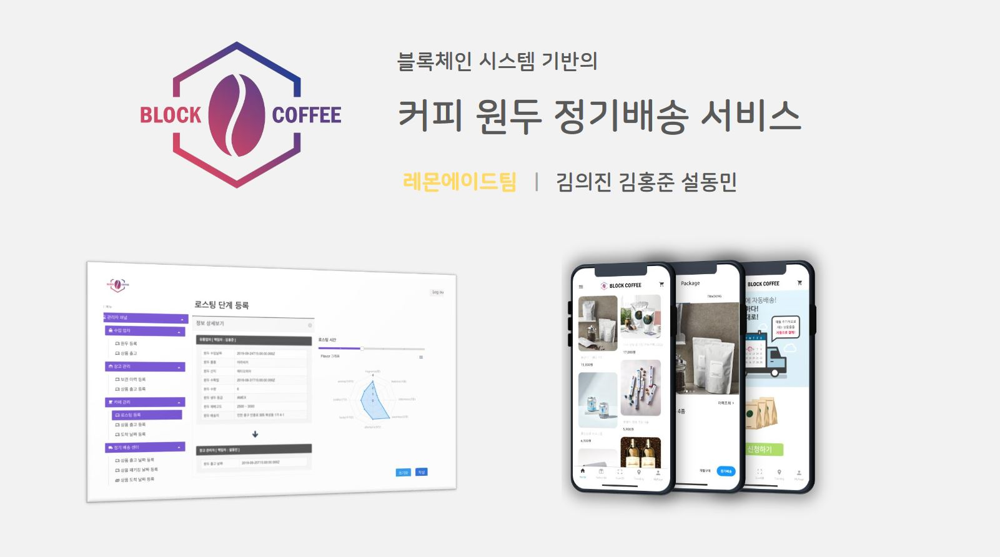
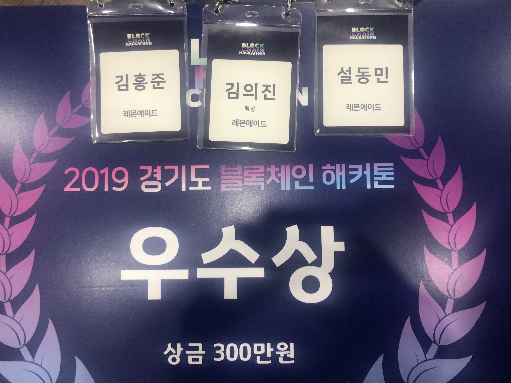

# 경기도 블록체인 해커톤

## 1. 공고

## 2. 주제

## 3. 수상
#### 2 등상)  창업부분 우수상 

## 4. 프로젝트
* 기획서 : 
    <embed src="./project_document_asset/doc/represent.pdf " type="application/pdf" />
    [링크](./project_document_asset/doc/represent.pdf "링크 제목")
* 사용 기술
  * 프론트 엔드
    * Vue
    
  * 백엔드
    *  express js

  * 하이브리드앱      
    * React Native 

## 5. 데모 영상
[데모 보러가기 ](https://drive.google.com/file/d/1nmjB3mPq1ydm1U1KsBti1UORw7VvvRP4/view?usp=sharing "링크 제목")